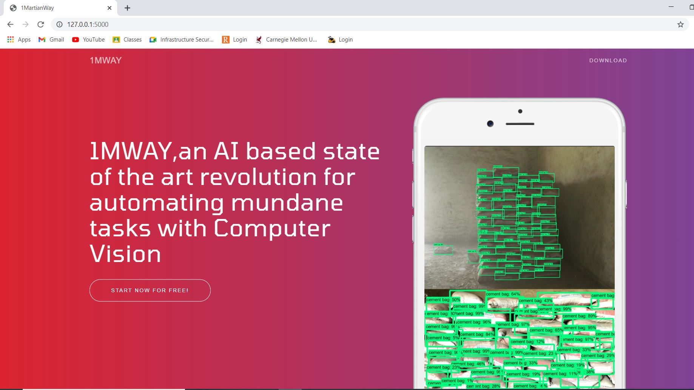
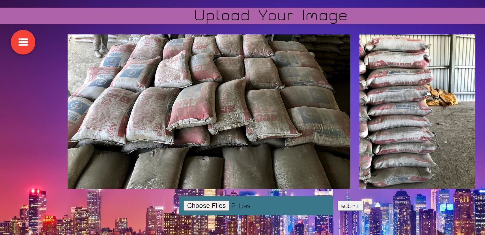
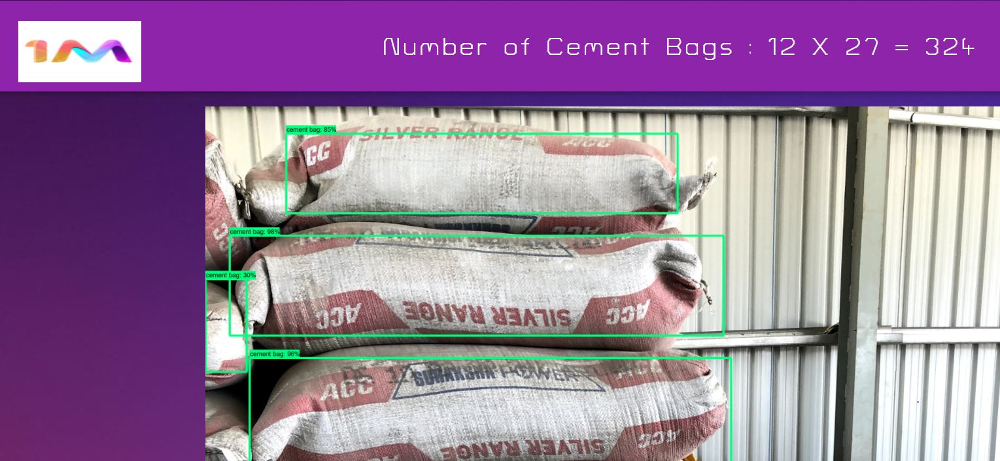
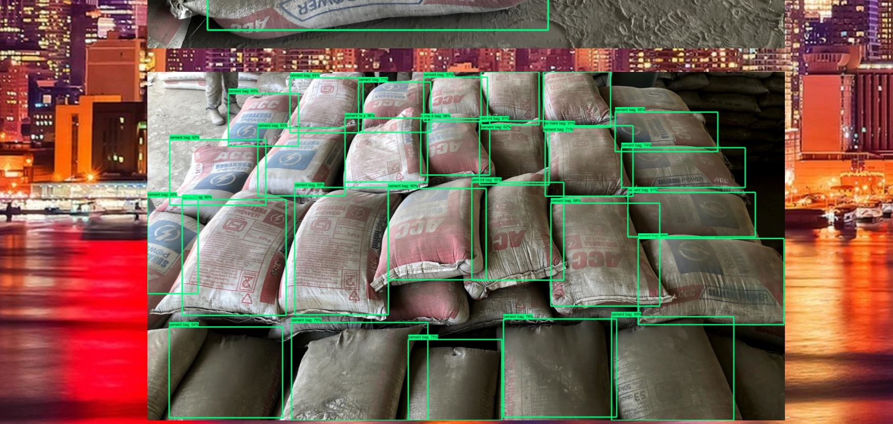

# ACC-Cement-Bag-Detector
Developed a software for ACC India to locate, segregate, and provide the count of cement bags in a given image using Computer Vision and Deep Learning. ACC India required the software to detect the total number of cement bags present in a stack using two images (front and top view of cement bags) . Purpose of software was to minimize the losses incurred because of inaccurate counting. Results were incorporated into a web application made using Flask. Object detection neural network was trained using Tensorflow Object Detection API.

Frameworks Used - Flask Web Framework 
Libraries Used - Werkzeug, SQLite, OpenCV, Numpy, Six, Tensorflow, Matplotlib, Pillow 
Modules Used - OS, Sys, Datetime, Tarfile, Zipfile, Collections, Io, Object Detection, Flask mail 

Procedure  

1. Installed TensorFlow Object Detection API. 
2. Took pictures with different backgrounds and varying lighting conditions. 
3. Labelled the data using LabelImg tool. 
4. Generated TFRecords used for training. 
5. Created a label map and training configuration file. 
6. Trained the model until it reached a satisfying loss. 
7. Generated the inference graph for running the model. 
8. Tested the object detector. 

 
Output

 
GUI of Web Application

 
Type of the object(ie. cement bag) is displayed alongwith the confidence score.

